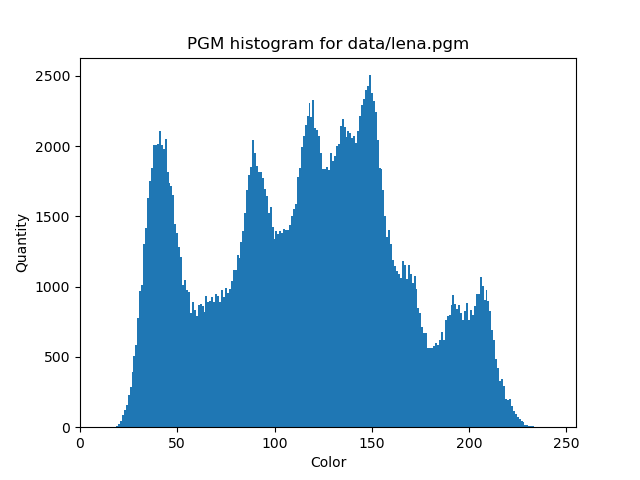
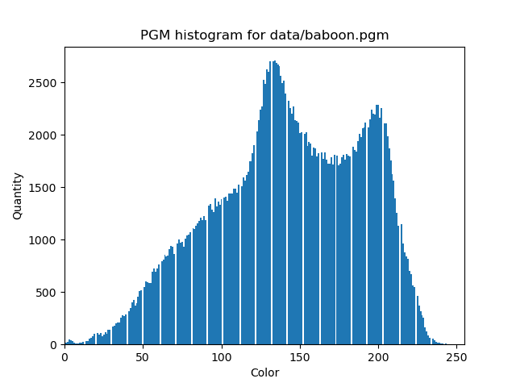
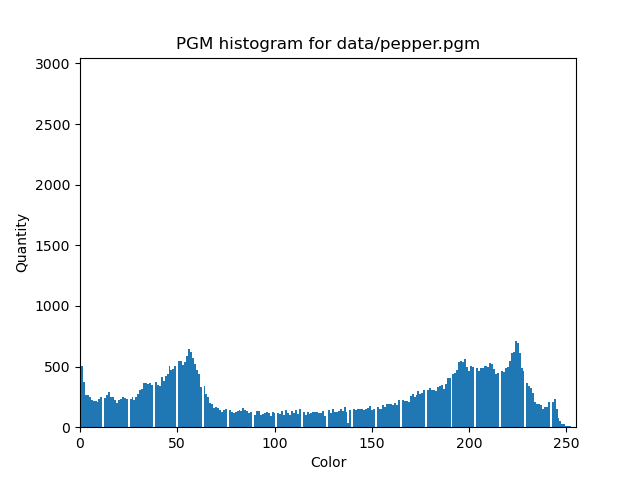

# OMP lab-2
---

## Description

This program is intended to show the fast and easy way to perform the array reduction during parallel computations with OpenMP. In this particular case, an image histogram calculation is used as a workload.

## Compilation and usage

In order to build the program, you have to run `make` command within the root folder. By default, Makefile uses `clang++` and `libomp-dev`, path to lib must be stored in the `$LIBRARY_PATH` environment variable, otherwise successful compilation might not be guaranteed.

The basic use-case scenario for this program is to run it as
```
$ ./build/omp_lab2.elf <in_file> <out_file> <num_threads>
```

The aforementioned input file must contain the P5 image with a header following the rules below:
```
P5
<width> <height>
<max value>
<binary data>
```

## Results interpretation

At the output we will have a file of size 1024 bytes or less (possible when the image has smaller `max value`). The file consists of 32 bit integer values with LE byte order (e.g., digit `1` will match the `01 00 00 00` hexadecimal byte sequence). Byte order will represent a color value, so the first byte will mean the BLACK color count and the 255th byte will mean the WHITE color count. Thus, a histogram can be drawn from these values by `build_histogram.py` python script or any other dedicated software.

## Test suite

All tests are located in the tests branch. The entire test suite is written in bash and performs black-box tests as well as time-measurements. It is enough to run the test suite once with a single script `tests/run_test_suite.bash` because it ensures the correct folder structure and installs required modules. After that, you can execute any tests as needed. Recommended folder structure with tests is shortly shown below.

```
data
    |-- img                             ### Static markdown images
    |-- baboon.pgm
    |-- lena.pgm
    `-- pepper.pgm
tests
    |-- run_test_suite.bash             ### Test suite runner
    |-- perf_tests.bash                 ### Performance measurement
    `-- sanity_check_black-box.bash     ### Functional testing
tools
    `-- build_charts.py                 ### Charts builder
```

## Test images

For the test purposes in this work, three classical test images were used: `lena.pgm`, `baboon.pgm` and `pepper.pgm`.

<p float="left">
    
    
    
</p>

This resulted in the following histograms:

<p float="left">
    
    
    
</p>

> **_NOTE_:** images in the `data/img` folder are not supposed to be tested, they are only used in this markdown file.

## Performance tests

The tests were made on different machines, one of which is a high-end 8-core modern CPU, and the other is an obsolete low-end 2-core CPU. The results are equally consistent on both of them.

### Performance / workload (different thread configs)

Here is the first comparison, that shows dependency of performance giving different configurations of threads; vertical axis is in logarithmic scale. Performance is measured as time, less is better.

As we can see on the chart, static scheduling is a favorite comparing to others.

<p float="left">
    
</p>

### Performance / chunk_size

Giving the best OpenMP scheduling configuration (i.e. static), a bar chart of performance over a chunk size can be built.
Here we can see that the default chunk size (chunk_inf) performs better than the others.

<p float="left">
    
</p>

---
#### ITMO University, spring of 2022